# Amazon SageMaker Model Serving using AWS CDK

This repository provides AI/ML service(MachineLearning model serving) modernization solution using [Amazon SageMaker](https://aws.amazon.com/sagemaker), [AWS CDK](https://aws.amazon.com/cdk), and [AWS Serverless services](https://aws.amazon.com/serverless).
(refer to [origin](https://github.com/aws-samples/amazon-sagemaker-model-serving-using-aws-cdk))

## Contents ## 

1. [**Repository structure**](#1-repository-structure)

2. [**Solution approach**](#2-solution-approach)

3. [**Solution architecture**](#3-solution-architecture)

4. [**How to prepare ML model**](#4-how-to-prepare-ml-model)

5. [**Build Environment**](#5-build-environment)

6. [**How to set up**](#6-how-to-set-up)
   
7. [**How to provision**](#7-how-to-provision)

8. [**How to test**](#8-how-to-test)

9. [**How to automate CICD**](#9-how-to-automate-cicd)

10. [**How to change model and endpoint configration**](#10-how-to-change-model-and-endpoint-configration)

11. [**How to set up auto-scaling**](#11-how-to-set-up-auto-scaling)

12. [**How to monitor**](#12-how-to-monitor)

13. [**How to clean up**](#13-how-to-clean-up)

14. [**About CDK-Project**](#about-cdk-project)


## **1. Repository structure**

This repository is basically a CDK-Project, but it is organized so that MLDevOps(ML Scientist + SW Developer + Infra Operator) can collaborate.

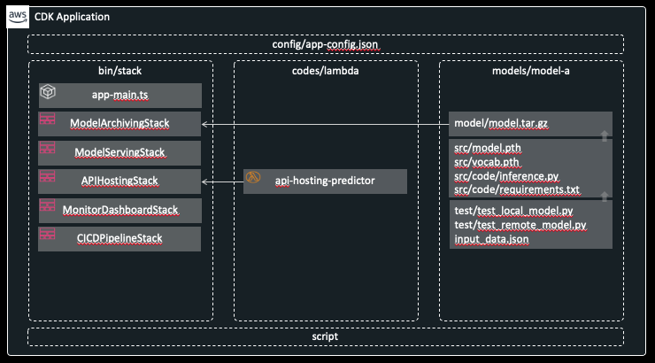


## **2. Solution approach**

In order to agile development and operation of such complex **AI/ML services**, we approach from [**Application Modernization**](https://aws.amazon.com/modern-apps) perspective
including serverless and container, CICD-based and IaC-based automation deploy/

- Data Collection: Inference History Logging
- Model Deployment: Models Archiving, Multiple Models Serving, Realtime Prediction
- Monitoring & Debugging: Endpoint Testing, Resource Monitoring

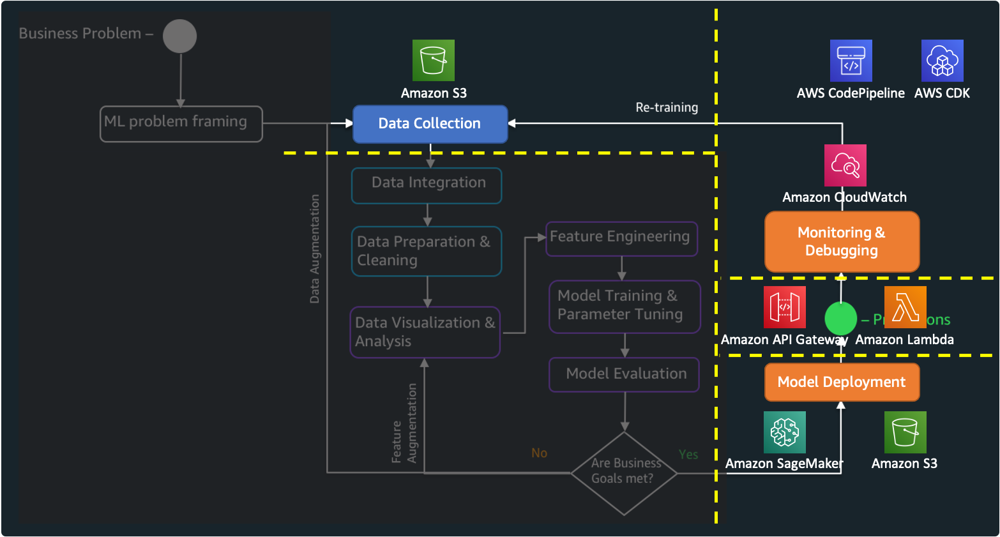

## **3. Solution architecture**

Basically this architecture is designed to provide a realtime endpoint using ML models.

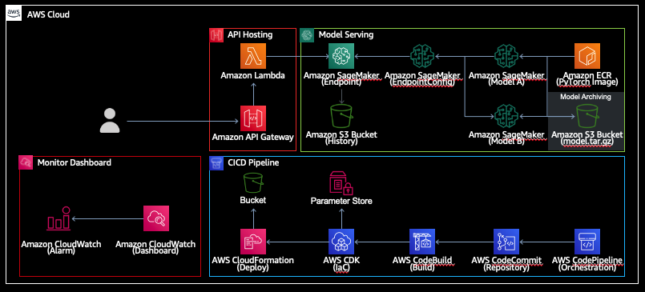

Each stack provides the follwing functions. In particular, the common functions of each stack are provided through ***BaseStack*** class by utilizing the characteristics of an object-oriented programming. Parameters such as resource name/ARN are shared between each stack through ***Parameter Store*** in AWS Systems Manager.

- Model Archiving Stack: Model Bucket Creation, model.tar.gz file Uploading
- Model Serving Stack: Models Loading, Multiple Models(A/B Testing) Serving, Inference Input/Output Logging
- API Hosting Stack: Serverless API Endpoint & Http Request Handling
- Monitor Dashboard: Serverless Resource Monitoring & Alarm
- CICD Pipeline: Continuous Integration & Continuous Deploy


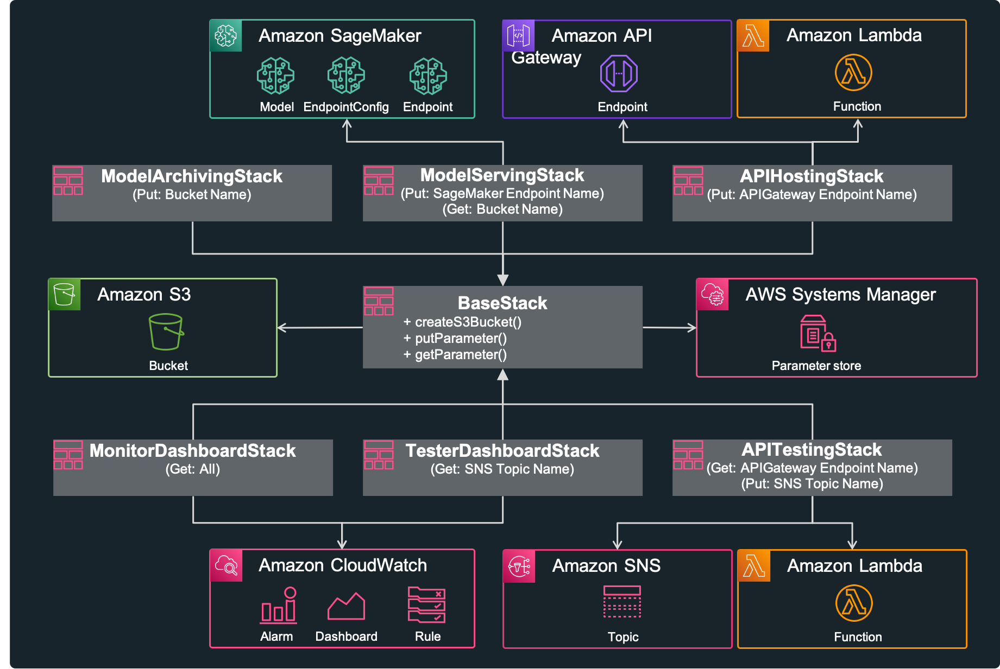

AWS services used are as follows:

- [Amazon SageMaker](https://aws.amazon.com/sagemaker): the most comprehensive ML service, which helps data scientists and developers to prepare, build, train, and deploy high-quality machine learning(ML) models quickly by bringing together a broad set of capabilities purpose-built for ML
- [Amazon API Gateway](https://aws.amazon.com/api-gateway): a fully managed service that makes it easy for developers to create, publish, maintain, monitor, and secure APIs at any scale
- [Amazon Simple Storage Service(S3)](https://aws.amazon.com/s3): object storage built to store and retrieve any amount of data from anywhere
- [Amazon Lambda](https://aws.amazon.com/lambda): a serverless computing which run code without thinking about servers
- [Amazon CloudWatch](https://aws.amazon.com/cloudwatch): a monitoring and observability service built for DevOps engineers, developers, site reliability engineers (SREs), and IT managers
- [Amazon System Manager Parameter Store](https://docs.aws.amazon.com/systems-manager/latest/userguide/systems-manager-parameter-store.html): secure, hierarchical storage for configuration data management and secrets management
- [AWS CodePipeline](https://aws.amazon.com/codepipeline): a fully managed continuous delivery service that helps you automate your release pipelines for fast and reliable application and infrastructure updates
- [AWS CloudFormation](https://aws.amazon.com/cloudformation): an easy way to model a collection of related AWS and third-party resources, provision them quickly and consistently, and manage them throughout their lifecycles, by treating infrastructure as code
- [AWS Cloud Development Kit(CDK)](https://aws.amazon.com/cdk): an open source software development framework to define your cloud application resources using familiar programming languages


## **4. How to prepare ML model**

We use the simple example model for the purpose of model serving. We will use Pytorch-based [text classification model](https://github.com/pytorch/text/tree/master/examples/text_classification) which is provided in [**pytorch/text**](https://github.com/pytorch/text).

These commands train Text-Classification model using AG_NEWS dataset under CPU environment. This model takes text as input and classifies one of the following four labels.

- 1: 'World'
- 2: 'Sports'
- 3: 'Business'
- 4: 'Sci/Tech'

If you are not ready for pytorch, please refer to this [installation guide](https://github.com/pytorch/text#installation).

```bash
git clone https://github.com/pytorch/text.git torchtext  
cd torchtext/examples/text_classification/  
mkdir .data  
python3 train.py AG_NEWS --device cpu --save-model-path  model.pth --dictionary vocab.pth  
```

Finally copy model script(***model.py***) and training outputs(***model.pth***, ***vocab.pth***) into ***models/model-a/src*** directory of this repository.

```bash
cp ./model.py ../../../amazon-sageMaker-model-serving-using-aws-cdk/models/model-a/src/code/  
cp ./model.pth ./vocab.pth ../../../amazon-sageMaker-model-serving-using-aws-cdk/models/model-a/src/  
```

This is a intermediate tree view in "models/model-a/src" directory.

```bash
models
└── model-a
    ├── src
    │   ├── code
    │   │   ├── inference.py
    │   │   ├── model.py       <--- this file is from pytorch/text
    │   │   └── requirements.txt
    │   ├── model.pth          <--- this file is from pytorch/text
    │   └── vocab.pth          <--- this file is from pytorch/text
    └── test
        ├── input_data.json
        ├── test_local_model.py
        └── test_remote_model.py
```

To create SageMaker Endpoint(realtime inference), We need to prepare two, the first is the model file(in here model.pth, vocab.pth) and the second is the associated script codes(in here inference.py, model.py). If we compress and upload these two into Amazon S3, Amazon SageMaker will load ***inference.py*** and call methods(model_fn, input_fn, predict_fn, output_fn) implemented in this file. And SageMaker install the additional dependecies using requirements.txt file. The figure below shows the abstract flow. Please check [SageMaker Python SDK - Deploy PyTorch Models](https://sagemaker.readthedocs.io/en/stable/frameworks/pytorch/using_pytorch.html#deploy-pytorch-models) for more details.

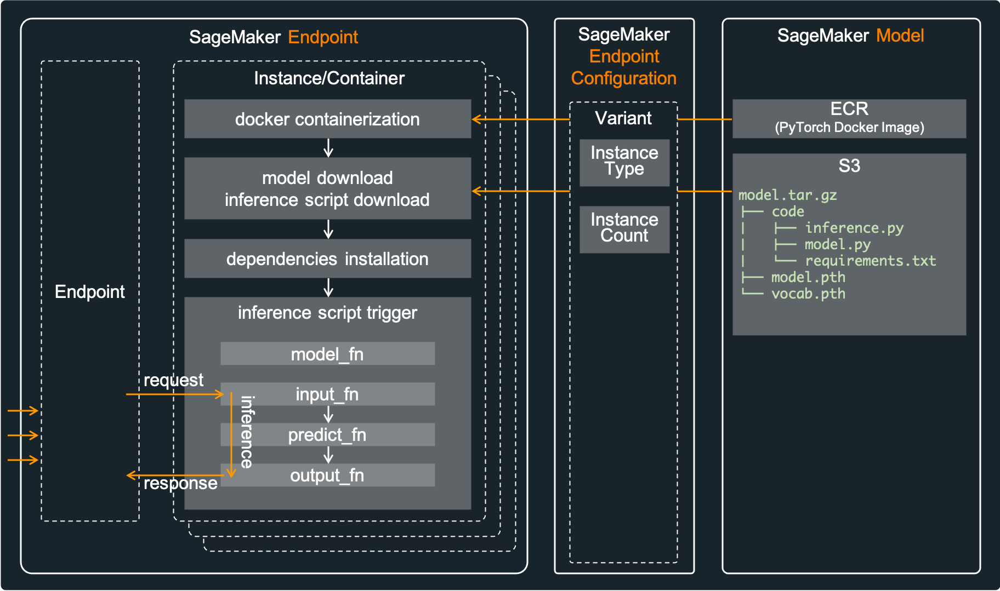

Now, let's test this model and inference scripts locally. It is very important to verify locally before deployment. Execute the following commands in root directory of this repository.

```bash
cd models/model-a/test  
python3 test_local_model.py  
...
...
-------------------------------------------------------------------
[tc-001]: result==>{"success": "true", "label": 1}
[tc-001]: completed==>The new president has called for an emergency conference for international cooperation.
-------------------------------------------------------------------
[tc-002]: result==>{"success": "true", "label": 2}
[tc-002]: completed==>Baseball is one of the most popular sports in the United States.
-------------------------------------------------------------------
[tc-003]: result==>{"success": "true", "label": 3}
[tc-003]: completed==>Stock investing has higher returns in the long run.
-------------------------------------------------------------------
[tc-004]: result==>{"success": "true", "label": 4}
[tc-004]: completed==>The development of science accelerated the development of mankind.
```

Finally compress these files to upload into Amazon S3. Execute the following command in root directory of this repository. This command will create ***model.tar.gz*** in "models/model-a/model", which will be uploaded to Amazon S3 through AWS CDK(***ModelArchivingStack***) later.

```bash
sh script/pack_models.sh  
```

This is a final tree view in "models/model-a/src" directory. Please make a note of that path(***models/model-a/model***) as it will be referenced later in [**How to configure**](#how-to-configure) step.

```bash
models/
└── model-a
    ├── model
    │   └── model.tar.gz
    ...
    ...
```

## **5. Build Environment**

1. Go to [Cloud9](https://console.aws.amazon.com/cloud9/home?region=us-east-1) in 'us-east-1'
   + Create Cloud9 Environment > us-east-1a > m5.large > EBS 100GB
1. Go to [CloudFormation](https://console.aws.amazon.com/cloudformation/home?region=us-east-1)
   + Check Status
1. Go to Cloud 9, Click "Open IDE" > Click "bash - terminal" on the bottom
1. run scripts 

   ```bash
   git clone https://github.com/awslego/amazon-sagemaker-model-serving-using-aws-cdk.git 
   cd amazon-sagemaker-model-serving-using-aws-cdk
   
   sh script/resize.sh
   
   aws s3 cp s3://textclassificationdemo-model-archiving-ap-northeast-2-51959/models/model-a/model/model.tar.gz models/model-a/src/
   cd models/model-a/src
   tar zxvf model.tar.gz
   mv model.tar.gz ../model/
   cd ../ 
   cp -r . ../model-b/
   ```

1. Create codecommit & Push codes

   ```bash
   aws codecommit create-repository --repository-name TextClassificationDemo 
   
   git remote add alias-remote https://git-codecommit.us-east-1.amazonaws.com/v1/repos/TextClassificationDemo
   git status
   git add *
   git commit -m "init"
   git push alias-remote main
   ```
   
And then, follow Section How to set up , How to provision , How to test.


## **6. How to set up**

※ Prerequisites <br/>
First of all, AWS Account and IAM User is required. And then the following must be installed.
```bash
node --version
cdk --version
jq --version

aws configure --profile default
cat ~/.aws/credentials   
```

Enter your project basic configuration in the follwoing document: config/app-config.json. 

+ Fill in your project's "Name", "Stage", "Account", "Region", "Profil" in "Project".
+ Fill in your project's "RepositoryName", "BranchName"  in "CICDPipeline".
```json
{
    "Project": {
        "Name": "TextClassification",
        "Stage": "Demo",
        "Account": "75157*******",
        "Region": "us-east-1",
        "Profile": "default"
    },
    ...
    ...
 
        "CICDPipeline": {
         "Name": "CICDPipelineStack",
         "RepositoryName": "TextClassificationDemo",
         "BranchName": "main"
     },
}     
```

If you don't know AWS Account/Region, execute the following commands to catch your AWS-Account.

```bash
aws sts get-caller-identity --profile default
...
...
{
    "Account": "[account-number]", 
    "UserId": "[account-id]", 
    "Arn": "arn:aws:iam::12345678912:user/[iam-user-id]"
}
```

And then execute the following commands to set up CDK-Project. For details, please check **setup_initial.sh** file.

```bash
sh ./script/setup_initial.sh  
```

## **7. How to provision**

Let's check stacks included in this CDK-Project before provisining. Execute the following command. The prefix is "***TextClassificationDemo***" (Project Name/Stage in config/app-config.json).
refer to [CDK CLI](https://docs.aws.amazon.com/cdk/latest/guide/cli.html)
```bash
cdk list
```

Each item in "Stack" of ***app-config.json*** represents a stack of the same name. 
Each stack performs the follwoing roles:
- TextClassificationDemo-ModelArchivingStack: create S3 Bucket, and upload model.tar.gz into S3 Bucket
- TextClassificationDemo-ModelServingStack: create SageMaker Model, EndpointConfiguration, Endpoint, and Inference Input/Output Logging(Data capture)
- TextClassificationDemo-APIHostingStack: create API Gateway and Lambda Function
- TextClassificationDemo-MonitorDashboardStack: create CloudWatch Dashboard, Alarm, SNS, and SES
- TextClassificationDemo-CICDPipelineStack: create CodePipeline, CodeBuild

The cdk synth command synthesizes a stack defined in your app into a CloudFormation template.
```bash
cdk synth
```

Now, everything is ready, let's provision all stacks using AWS CDK. Execute the following command which will deploy all stacks in order of subordination.
```bash
#sh script/deploy_stacks.sh 
cdk deploy *-ModelArchivingStack --require-approval never --profile default

cdk deploy *-ModelServingStack --require-approval never --profile default

cdk deploy *-APIHostingStack --require-approval never --profile default

cdk deploy *-MonitorDashboardStack --require-approval never --profile default

cdk deploy *-CICDPipelineStack --require-approval never --profile default
```

This picture is a result of multiple(A/B Testing) model serving in SageMaker after ModelServingStack deployment.

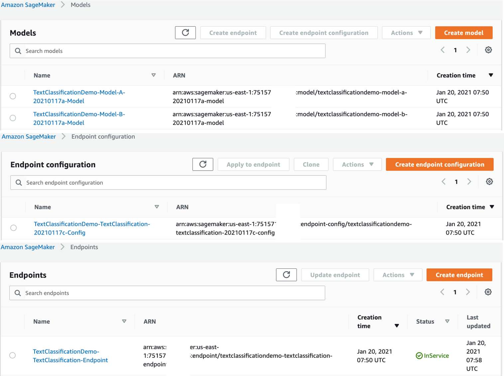


## **8. How to test**

For testing, execute the following command, which the lambda functions will be executed to call API Gateway.

```bash
sh script/trigger_tests.sh
...
...
{
"MessageId": "e78906f5-4544-5e19-9191-5e9ea2a859bd"
}
```

## **9. How to automate CICD**
Push updated codes to codecommit. 
```bash
git status
git add *
git commit -m "Update"
git push alias-remote main
```
Since codepipeline has already been created, just codecommit will automatically build and deploy.


## **10. How to change model and endpoint configration**

After initial deployment, you can change to a new model file(ModelS3Key, ModelLocalPath) or change deployment settings(InstanceCount, InstanceType). If you change these settings, you must change ***ModelName***, ***EndpointConfigName***. This is mandantory, because SageMaker Model/EndpointConfig does not support to edit these values. In other words, changing these names will delete the previous Model/EndpointConfig and creat a new Model/EndpointConfig.
If you have already ***model.tar.gz*** file in S3 Bucket so you don't need upload a local ***model.tar.gz*** file, keep ***ModelLocalPath*** empty.

```json
      "ModelServing": {
            "Name": "ModelServingStack",

            "ModelList": [
                {
                    "ModelName":   "Model-A-20210117a", <-- change ModelName if ModelS3Key or ModelDockerImage is modified, and then change EndpointConfigName also
                    "ModelS3Key":     "models/model-a/model",
                    "ModelDockerImage": "763104351884.dkr.ecr.us-east-1.amazonaws.com/pytorch-inference:1.4.0-cpu-py36-ubuntu16.04",
                    
                    "VariantName": "Model-A",
                    "VariantWeight": 1,
                    "InstanceCount": 1,
                    "InstanceType": "ml.c4.xlarge",

                    "AutoScalingEnable": false,
                    "AutoScalingMinCapacity": 1,
                    "AutoScalingMaxCapacity": 3,
                    "AutoScalingTargetInvocation": 70
                }
            ],

            "EndpointConfigName":   "TextClassification-20210117c", <--- change EndpointConfigName if ModelName or VariantName or VariantWeight or InstanceCount or InstanceType
            "BucketBaseName": "model-serving",

            "EndpointName":      "TextClassification",
            "Deploy": true
        }
```

## **11. How to set up auto-scaling**

We can activate/deactivate auto-scaling feature of SageMaker Endpoint. Since this is a runtime option, you can activate/deactivate it while SageMaker Endpoint has been provisioned in advance. Therefore, you can deploy it as false at the time of initial deployment and then set it to true from the next time. For more details, please check this [document](https://docs.aws.amazon.com/sagemaker/latest/dg/endpoint-auto-scaling.html).

```json
        "ModelServing": {
            "Name": "ModelServingStack",

            "ModelList": [
                {
                    "ModelName":   "Model-A-20210117a",
                    ...
                    ...

                    "AutoScalingEnable": false,  <--- this is a option to activate/deactivate auto-scaling
                    "AutoScalingMinCapacity": 1,
                    "AutoScalingMaxCapacity": 3,
                    "AutoScalingTargetInvocation": 70
                },
                {
                    "ModelName":   "Model-B-20210117a",
                    ...
                    ...

                    "AutoScalingEnable": false,  <--- this is a option to activate/deactivate auto-scaling
                    "AutoScalingMinCapacity": 2,
                    "AutoScalingMaxCapacity": 4,
                    "AutoScalingTargetInvocation": 50
                }
            ],

            ...
            ...
        },
```

## **12. How to monitor**

After a while, go to CloudWatch Dashboard(TextClassificationDemo-MonitorDashboard, TextClassificationDemo-TesterDashboard) and check the results.

***TextClassificationDemo-TesterDashboard***

This dashboard describes testing status. In the dashboard below, 1 SNS message was pulished and 5 lambda functions received that. ***ResponseTime-ApiGateway***, ***SuccessSum-ApiGateway***, and ***FailSum-ApiGateway*** are custom metrics sent by TesterLambda. this dashboard show that response time is about 0.05ms(this metric can be different according your environment). It can be seen that all test cases were successful, and none failed.
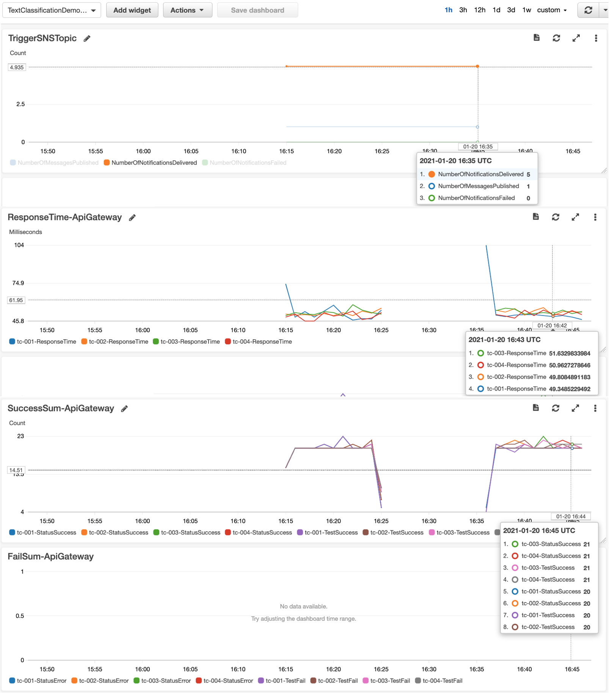

***TextClassificationDemo-MonitorDashboard***

This dashboard is the current status of all resources. The following picture shows realtime status of API Gateway, Lambda function, and SageMaker Endpoint.

MonitorDashboard-ApiGateway
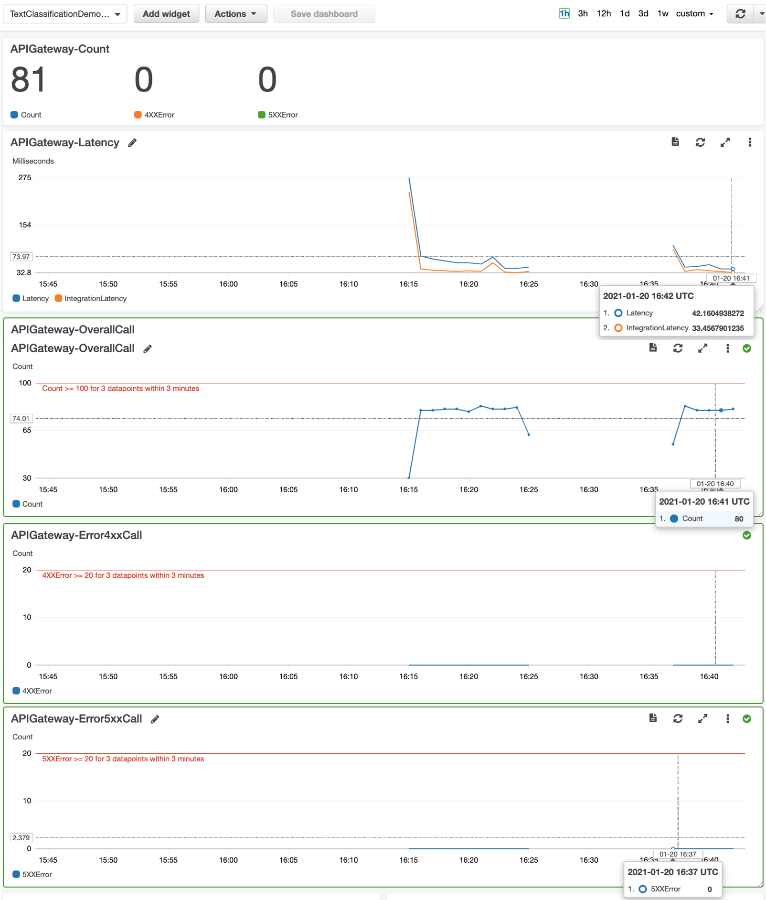

MonitorDashboard-Lambda
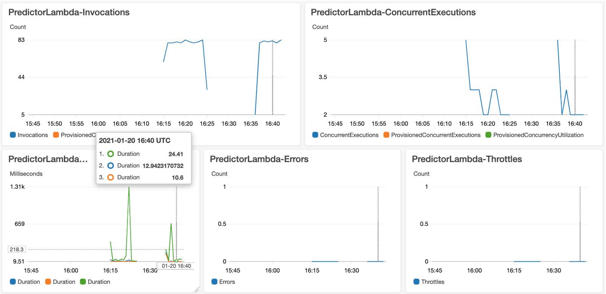

MonitorDashboard-SageMaker-Endpoint
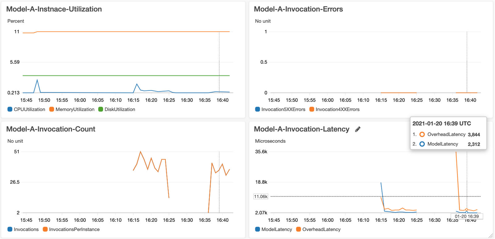

***Inference History Logging - S3 Bucket***

The following picture shows the logging results in S3 Bucket.

Inference-History-Bucket
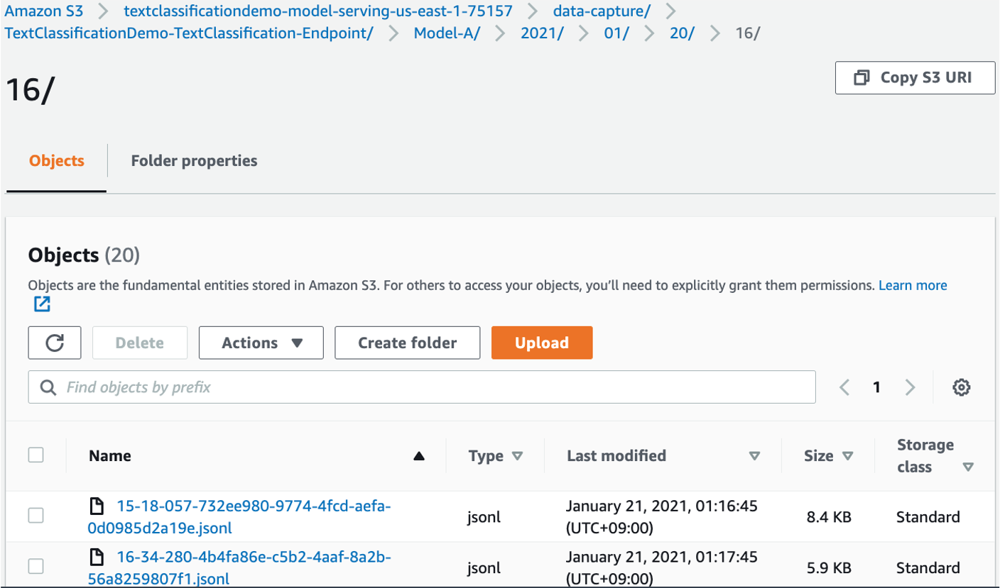

Inference-History-Jsonl
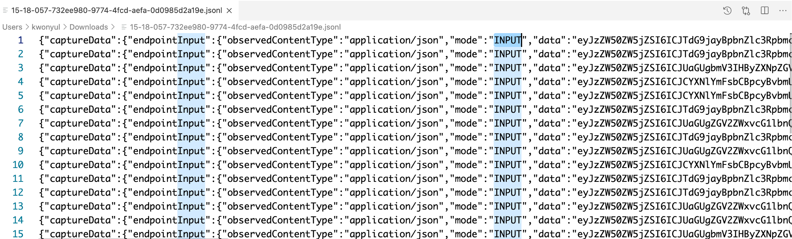

Also alarm threshold(ApiGatewayOverallCallThreshold, ApiGatewayError4xxCallThreshold, ApiGatewayError5xxCallThreshold) can be modified according to your operation scenario. Just change these items in ***app-config.json***, and then deploy ***TextClassificationDemo-MonitorDashboard***.

And change SES subscription email address in ***config/app-config.json***, which will send subscription confirmation mail to "SubscriptionEmails".

```json
...
        "MonitorDashboard": {
            "Name": "MonitorDashboardStack",

            "DashboardName": "MonitorDashboard",

            "SubscriptionEmails": ["abc@amazon.com", ....],
            "ApiGatewayOverallCallThreshold": 100,
            "ApiGatewayError4xxCallThreshold": 20,
            "ApiGatewayError5xxCallThreshold": 20
        },
...
```

Finally deploy and test again like this. ***script/deploy_stacks.sh** will deploy only changed stacks such as ***TextClassificationDemo-APITestingStack***, ***TextClassificationDemo-TesterDashboardStack***, TextClassificationDemo-MonitorDashboard.

```bash
sh script/deploy_stacks.sh
sh script/trigger_tests.sh
```

## **13. How to clean up**

Execute the following command, which will destroy all resources except S3 Buckets. So destroy these resources in AWS web console manually.

```bash
sh script/destroy_stacks.sh
```

### **About CDK-Project**

The `cdk.json` file tells the CDK Toolkit how to execute your app.

And the more usuful CDK commands are

- `cdk list`        list up CloudFormation Stacks
- `cdk deploy`      deploy this stack to your default AWS account/region
- `cdk diff`        compare deployed stack with current state
- `cdk synth`       emits the synthesized CloudFormation template
- `cdk destroy`     remove resources

### **Security**

See [CONTRIBUTING](CONTRIBUTING.md#security-issue-notifications) for more information.

### **License**

This library is licensed under the MIT-0 License. See the LICENSE file.